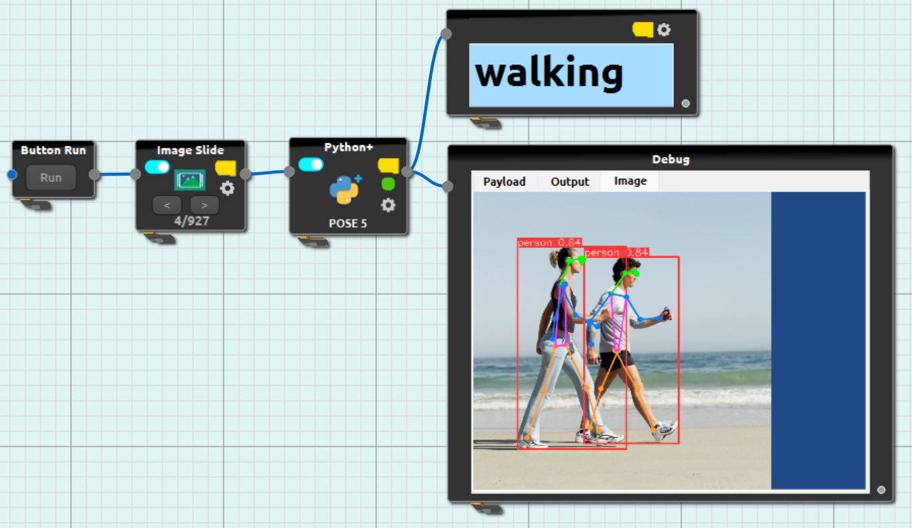
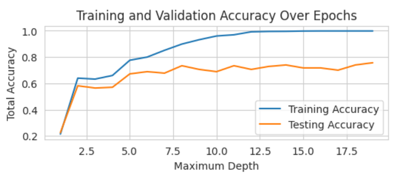
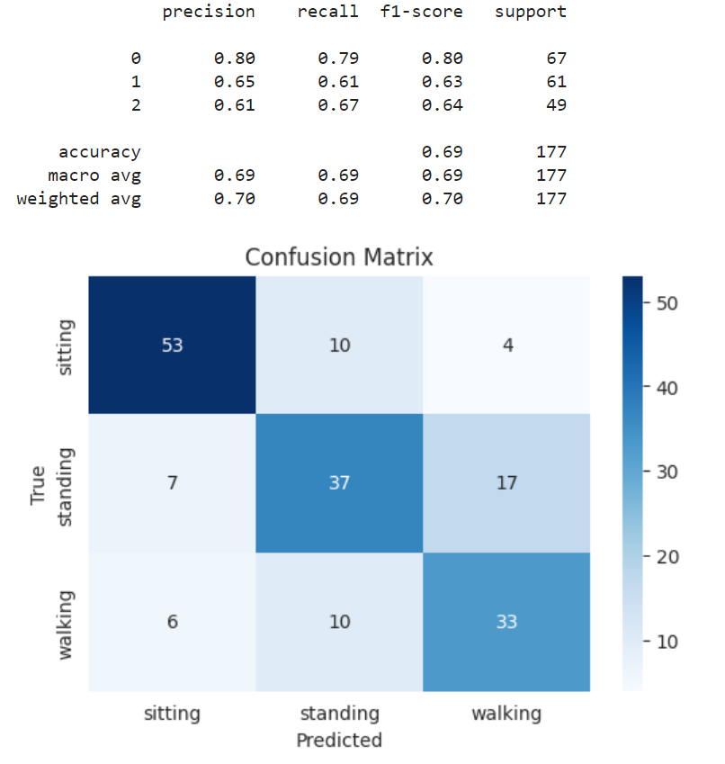

# CiRA_Pose_Estimation
The application of Human Activity Recognition using CiRA Core IDE.
The dataset was obtain from kaggle websit below
- https://www.kaggle.com/datasets/jithinnambiarj/human-activity-detection-dataset
- https://www.kaggle.com/datasets/sharjeelmazhar/human-activity-recognition-video-dataset

 
 
 

